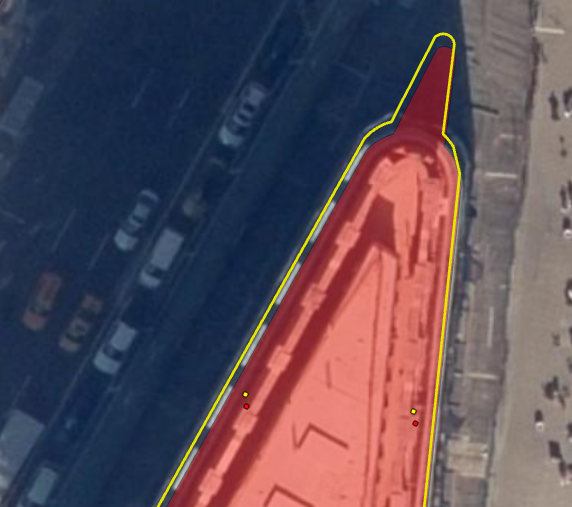
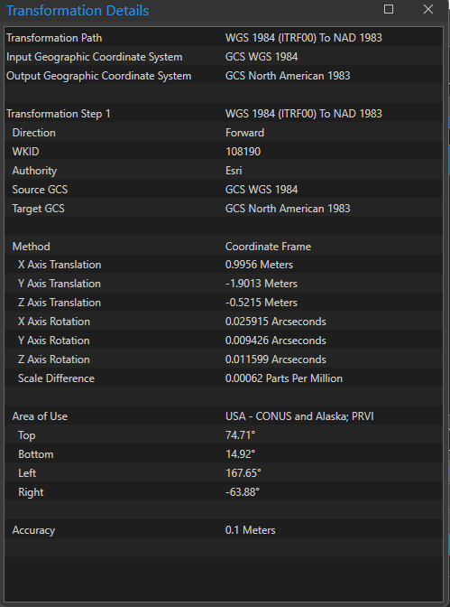

# nyc-spatial-coordinate-systems


## Quick Reference

| EPSG Code  | Description | ESRI Software | Lower Left X | Lower Left Y | Upper Right X | Upper Right Y | 
| ------------- | ------------- | ------------- | ------------- | ------------- | ------------- | ------------- |
| [2263](https://epsg.io/2263)  | New York State Plane Lambert Conformal Conic  | NAD 1983 StatePlane New York Long Isl FIPS 3104 (US Feet) | 900000 | 110000 | 1090000 | 295000 |
| [6539](https://epsg.io/6539)  | (NAD 2011) New York State Plane Lambert Conformal Conic | NAD 1983 (2011) StatePlane New York Long Isl FIPS 3104 (US Feet) | 900000 | 110000 | 1090000 | 295000 |
| [4326](https://epsg.io/4326) | WGS84 World Geographic Coordinate System | WGS 1984 | -74.3027914 | 40.4681991 | -73.61703247 | 40.97574288 |
| [4269](https://epsg.io/4269) | NAD 83 Local Datum | NAD 1983 | -74.3027914 | 40.4681991 | -73.61703247 | 40.97574288 |
| [3857](https://epsg.io/3857) | Web Mercator | WGS 1984 Web Mercator (auxiliary sphere) | -8271348.9 | 4934214.8 | -8195010.6 | 5008764.4 |

## Glossary 

From earthy to mappy

**geoid**
* a lumpy earth model that is equal gravity global mean sea level 
* it is lumpy because of gravitational variations
* different stuff under our feet (mountains, dinosaur bones) changes gravity 

**global ellipsoid**
* a decent approximation of the geoid
* geocentric: a mathematical model with the earth at the center
* wider at the equator than tall at the poles
* WGS 84, the most common lat/lon geographic coordinate system, uses a global ellipsoid
* technically when 2 of 3 ellipsoid axes are equal this is a spheroid.  A spheroid is a type of ellipsoid like a square is a type of rectangle
  

**local ellipsoid**
* also known as a reference ellipsoid
* an ellipsoid fitted nicely to one section of the earth
* can be fixed to tectonic plates and adjusted with the movement of ground control points

**datum**
* based off of ellipsoids with elevation. 
* can be local datums based off of local ellipsoids (ex NAD 83)
* can be global datums based off of global ellipsoids (ex WGS 84)
* when expressed as lat/lon these are GEOGRAPHIC COORDINATE SYSTEMS

**projections**
* flattening of datums onto flat surfaces like screens and maps
* lambert conformal conic is a common projection for local city and state agencies
* when expressed as x,y these are PROJECTED COORDINATE SYSTEMS

## North American Datums and Corresponding NYC Projected Coordinate Systems 

The positional shifts in these coordinate reference systems can be up to about 3/4 of a meter. It is always best to state precisely which one a dataset uses.

| Name  | EPSG Code | Notes | 
| ------------- | ------------- | ------------- | 
| NAD 83 | http://epsg.io/2263 |  |
| NAD 83 (HARN) | http://epsg.io/2908 | Harn = High Accuracy Reference Network |
| NAD 83 (CORS) | ? | CORS = Continuously Operating Reference Stations |
| NAD 83 2007 readjustment | http://epsg.io/3628 |  http://www.ngs.noaa.gov/NationalReadjustment/ |
| NAD 83 2011 readjustment | http://epsg.io/6539 | http://www.ngs.noaa.gov/web/surveys/NA2011/ |
| NAPGD2022 |  |  |


## NYC GIS Data Transformation Details 

| Dataset | Source Coordinate System | Published | Published Coordinate System | Transformation Used |
| ------------- | ------------- | ------------- | ------------- | ------------- | 
| [building footprints](https://github.com/mattyschell/geodatabase-buildings) | [2263](https://epsg.io/2263) | [ArcGIS Online](https://nyc.maps.arcgis.com/home/item.html?id=870bf69e8a8044aea4488e564c0b4010) | [3857](https://epsg.io/3857) | NAD 83 <-> WGS 1984 (ITRF00) to NAD 83 <-> WGS 1984 |
| CSCL | [2263](https://epsg.io/2263) | [ArcGIS Online](https://nyc.maps.arcgis.com/home/index.html) | [3857](https://epsg.io/3857) | NAD 83 <-> WGS 1984 (ITRF00) to NAD 83 <-> WGS 1984 |
| [Planimetrics 2012/2014](https://github.com/CityOfNewYork/nyc-planimetrics/blob/master/Capture_Rules.md) | [2263](https://epsg.io/2263) | [ArcGIS Online](https://nyc.maps.arcgis.com/home/index.html) | [3857](https://epsg.io/3857) | NAD 83 <-> WGS 1984 (ITRF00) to NAD 83 <-> WGS 1984 |
| [Planimetrics 2012/2014](https://github.com/CityOfNewYork/nyc-planimetrics/blob/master/Capture_Rules.md) | [2263](https://epsg.io/2263) | [NYC Open Data](https://opendata.cityofnewyork.us/) | [2263](https://epsg.io/2263)  | None |
| Planimetrics 2022 | [2263](https://epsg.io/2263) | [ArcGIS Online](https://nyc.maps.arcgis.com/home/index.html) WIP | [3857](https://epsg.io/3857) | NAD 83 <-> WGS 1984 (ITRF00) to NAD 83 <-> WGS 1984 |
| [NYC Map Tiles](https://maps.nyc.gov/wmts/1.0.0/?REQUEST=getcapabilities) | [2263](https://epsg.io/2263) | maps.nyc.gov | [900913](https://epsg.io/900913) | 2263 <-> WGS84.  No datum transformation |


## Background Reading

* [history of NYC coordinate reference systems](https://nycitymap.wordpress.com/2016/09/13/nyc-projected/)
* [presentation on projections and coordinate systems](http://mjfoster83.github.io/projections/index.html#/)
* [datum tutorial](https://vdatum.noaa.gov/docs/datums.html)
* [historical surveys and systems in NYC](https://web.archive.org/web/20191011125423/https://www.pobonline.com/articles/89732-web-exclusive-the-xs-and-ys-of-the-big-apple)
* [1914 NYC leveling and benchmarks](https://web.archive.org/web/20191011125423/https://www.pobonline.com/articles/89732-web-exclusive-the-xs-and-ys-of-the-big-apple)
* [NY Times article on height modernization](https://web.archive.org/web/20191011125423/https://www.pobonline.com/articles/89732-web-exclusive-the-xs-and-ys-of-the-big-apple)
* [NY Times article on the end of the US Survey foot](https://web.archive.org/web/20200819115447/https://www.nytimes.com/2020/08/18/science/foot-surveying-metrology-dennis.html)
* Differences between NAD 83 and WGS 84
   * [ESRI Summary](https://support.esri.com/en-us/knowledge-base/how-to-determine-which-nad1983towgs1984-transformation-000005929)
   * [Canadian presentation](http://naref.org/transf/nad83_hydroscan2006.pdf)


## FAQ

### In PostGIS how do I perform a datum-shifted transformation from WGS84 to New York state plane? 

Many people are asking.  

ESRI's ArcGIS Pro and ArcGIS Online perform the shift by default.  Data produced in PostGIS may appear "shifted" by approximately 3 feet using the default ST_Transform.

Here's the world-famous Flatiron Building and 2 of its address points.  Red is the source data displayed in New York State Plane Lambert Conformal Conic. Yellow is WGS84 lon/lat data transformed without a datum shift.



Here's the world-famous ArcGIS Pro transformation details. 



PostGIS uses the "proj" open source database.  It's stored as SQLLite in a location like this on Windows - C:\Program Files\PostgreSQL\16\share\contrib\postgis-3.5\proj\proj.db

That database includes a table named "helmert_transformation_table."  This table is named after our man [Friedrich Helmert](https://en.wikipedia.org/wiki/Helmert_transformation). The ESRI code 108190 is in there.

```sql
select
	auth_name,
	code,
	name,
	source_crs_auth_name,
	source_crs_code,
	target_crs_auth_name,
	target_crs_code
from
	helmert_transformation_table
where
	code = 108190
```

| auth_name | code   | name                         | source_crs_auth_name | source_crs_code | target_crs_auth_name | target_crs_code |
|-----------|--------|------------------------------|-----------------------|------------------|-----------------------|------------------|
| ESRI      | 108190 | WGS_1984_(ITRF00)_To_NAD_1983 | EPSG                  | 4326             | EPSG                  | 4269             |

To use this in PostGIS you will need a fairly recent version (3.4+)  that includes [ST_TransformPipeline](https://postgis.net/docs/manual-3.4/ST_TransformPipeline.html).

Here is a transformation without the datum shift.

```sql
select
	ST_Transform(ST_SETSRID(ST_MakePoint(-73.98272, 40.74518)
                           ,4326)
                ,2263);
```

--> POINT (989038.1655756367 210766.27823605755)

Here it is with the shift. This is the answer to the FAQ.

```sql
select
	ST_Transform(ST_TransformPipeline(  
    				ST_SetSRID(ST_MakePoint(-73.98272, 40.74518), 4326)
       			   ,'urn:ogc:def:coordinateOperation:ESRI::108190'
       			   ,4269)
       		   ,2263);
```

--> POINT (989038.5660188518 210763.2676373856)

These points are approximately 3 feet apart.

Here's the inverse, going from New York State Plane to WGS84. It's a mirror image of the forward direction!

```sql
select 
	ST_InverseTransformPipeline(ST_Transform(
									ST_SetSRID(ST_MakePoint(989038.5660188518,210763.2676373856),2263)
								   ,4326)
								,'urn:ogc:def:coordinateOperation:ESRI::108190'
								,4269);
```

### How many decimal digits of precision should I use for data in latitude longitude?

Use 7 if you are a normal person doing normal GIS work.

The sixth decimal digit represents the limit of most forms of data collection such as heads up digitizing  or GPS. The sixth digit (0.000001 degrees) is approximately 4 inches at the equator. By including one more digit, the seventh, you ensure that any rounding or other calculations take place in the 7th digit. This keeps the possibly meaningful 6th digit stable.

Internally most geographic information systems store and operate on data using [floating point numbers](https://en.wikipedia.org/wiki/Floating-point_arithmetic). So while it may be helpful to think about limiting your digits on input, display, and across networks, if you are a GIS person doing GIS work on a computer you are not helping yourself by thinking about significant digits.